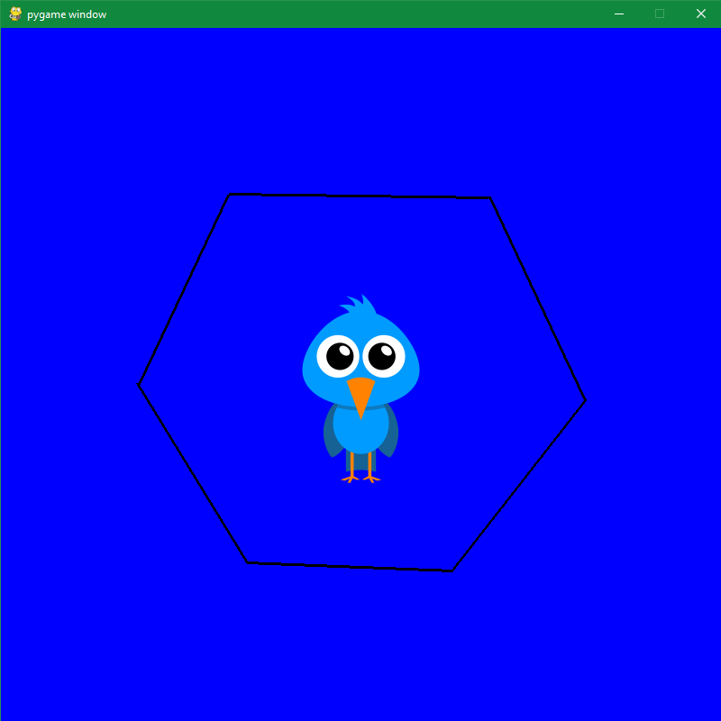

## oc20 - Projet Editor

## Introduction
L'éditeur graphique permet de :
* permet de manipuler des objets (rectangles, cercles, lignes, images)
* permet de choisir les couleurs et les épaisseurs
* permet de créer, déplacer, supprimer des objets
* permet de sauvegarder/charger un dessin

## Description
Notre éditeur peut faire plusieurs choses : 
* Créer des segments 
* Les supprimer / rajouter
* Bouger l'image à l'appui d'une macro
* Changement de couleurs du background

## Interface

## Raccourcis Clavier
* N = Faire bouger ou freeze l'image
* Z = Undo
* Y = Redo
* W = Passer le background en WHITE
* V = Passer le background en GREEN
* R = Passer le background en RED
* B = Passer le background en BLUE

## Manipulations avec la souris
* Maintenir le clique et le relâcher pour créer un segment, ceci est seulement possible si l'image est freeze via la touche "N". Pour faire bouger l'image, represser sur la touche "N" et effectuer un mouvement via la souris

## Conclusion
