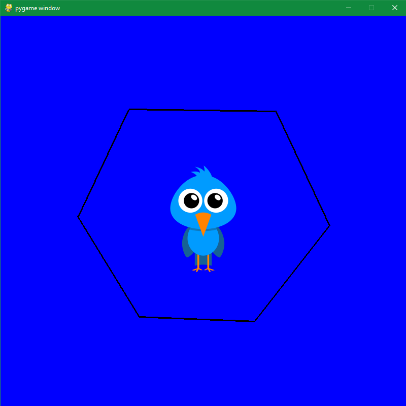

# oc20 - Projet Editor

## Introduction
*L'éditeur graphique permet de :*
* permet de manipuler des objets (rectangles, cercles, lignes, images)
* permet de choisir les couleurs et les épaisseurs
* permet de créer, déplacer, supprimer des objets
* permet de sauvegarder/charger un dessin

## Description
*Notre éditeur peut faire plusieurs choses :*
* Créer des segments 
* Les supprimer / rajouter
* Bouger l'image à l'appui de différentes macros
* Changement de couleurs du background

## Interface
*Voici un exemple de création que vous pouvez effectuer via notre éditeur :*

## Raccourcis Clavier
* **N =** Faire bouger ou geler l'image
* **Z =** Undo
* **Y =** Redo
* **K =** Recentrer l'image
* **W =** Passer l'arrière plan en blanc
* **V =** Passer l'arrière plan en vert
* **R =** Passer l'arrière plan en rouge
* **B =** Passer l'arrière plan en bleu
* **G =** Passer l'arrière plan en gris
* **Flèche du Haut =** Déplace l'image vers le haut
* **Flèche du Bas =** Déplace l'image vers le bas
* **Flèche de Droite =** Déplace l'image vers la droite
* **Flèche de Gauche =** Déplace l'image vers la gauche

## Manipulations avec la souris
*Maintenir le clique et le relâcher pour créer un segment, ceci est seulement possible si l'image est gelée via la touche "N". Pour faire bouger l'image, represser sur la touche "N" et effectuer un mouvement avec la souris*

## Conclusion
Le but de ce travail a été atteint. La prochaine étape consistera a utiliser cet éditeur graphique pour créer un jeu basé sur le type *tower defense*.
(type de jeu changé par la suite)
