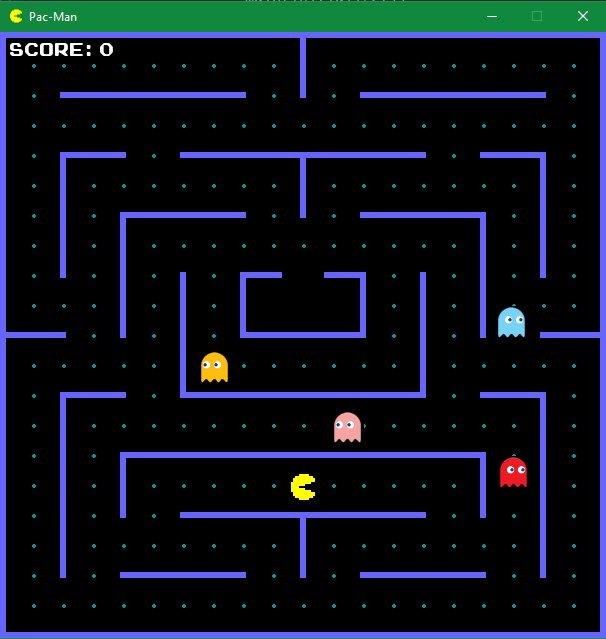
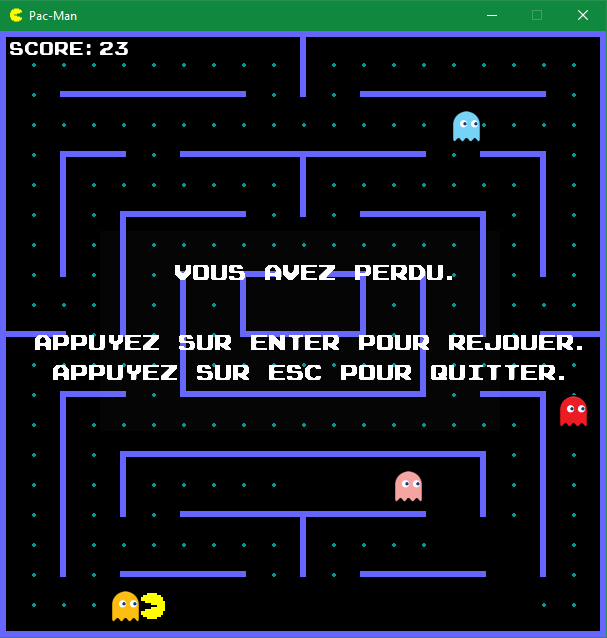
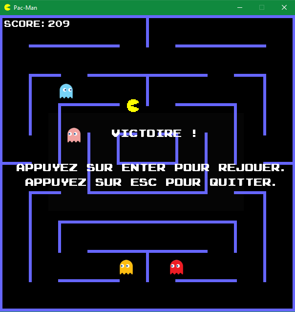

## Projet Pac-Man

## But de notre jeu
*Notre jeu est extrêmement connu dans le monde de l'arcade, c'est l'un des jeux les plus connus au monde. Il existe depuis 1980 ([Wikipédia Pac-Man](https://fr.wikipedia.org/wiki/Pac-Man)), ce qui fait de lui un jeu très ancien. Vous connaissez très certainement le principe du jeu étant donné que tout le monde le connaît mais nous allons très rapidement le ré-expliquer. Le héros du jeu s'appel "Pac-Man" et son but est de manger toutes les petites boules disposées sur l'ensemble de la surface de la map, mais une équipe de 4 fantômes de couleurs bien différentes vont faire en sorte que Pac-Man ne puisse pas manger l'entièreté des boules, et donc gagner la partie.*

## Comment jouer ?
*C'est un jeu qui est très simple au niveau de sa compréhension. Pour jouer au jeu, vous devrez utiliser les quatres flèches que vous avez sur votre clavier pour faire bouger Pac-Man. La flèche du haut le fait monter, celle du bas le fait descendre, celle de gauche le fait tourner à gauche et celle de droite, au contraire, le fait tourner à droite. Dans le cas où vous gagnez la partie ou que vous la perdez, deux possibilités s'offrent à vous, soit de refaire une partie en appuyant sur "ENTRER", soit de quitter le jeu en appuyant sur "ESC".*

*Vous pouvez visualiser ci-dessus ce que vous allez voir apparaître en lancant le fichier principal (main.py), c'est un Pac-Man très simple au niveau de la map dans le sens où c'est celui que nous connaissons tous, mais nous trouvions que rester dans la simplicité et dans les origines même du jeu est la meilleure chose à faire lorsque nous reproduisons celui-ci via Pygame.*

*Cette deuxième image de notre Pac-Man montre la vue que vous aurez lorsque votre partie sera perdue. Utilisez une police typée "Arcade" nous semblait indispensable pour rester sur les origines du jeu et oublier que celui-ci a été reproduit en 2021. L'histoire du jeu est en quelque sorte son ADN donc il n'était pas envisageable pour nous de lui retirer quelque chose d'aussi important.*

## Les classes (structure interne de notre jeu)
* ***Paths :** classe où se trouvent toutes les images nécessaires au bon fonctionnement du jeu (Fantômes / Pac-Man), mais également la police.*
* ***Colors :** classe où se trouvent toutes les couleurs dont nous aurons besoin, classe très basique.*
* ***Game :** classe dérivée d'une fonction qui va lancer le jeu (start).*
* ***Wall :** classe qui va créer les murs.*
* ***Food :** classe qui va générer la nourriture de Pac-Man, celle qui va nous permettre d'éventuellement gagner la partie.*
* ***Player :** classe qui va créer toutes les entités.*
* ***Level1 :** classe qui va lancer le premier niveau (seul et unique niveau **pour l'instant**).*

## Amélioration à prevoir sur Pac-Man
*La plus grande partie de Pac-Man a été faite, mais il manque encore deux trois détails à rajouter pour rendre le jeu parfait, comme par exemple le fait que Pac-Man puisse manger une petite boule qui lui donne la possibilité de manger les fantômes pendant quelques secondes. Également le fait d'ajouter un deuxième niveau (en plus du premier que nous avons déjà) avec comme unique ajout, un fantôme en plus qui rendrait la victoire encore plus compliquée.*

## Amélioration à prévoir sur l'ensemble de notre projet
*Nous avons pris longtemps à trouver le jeu que nous voulions choisir pour ce projet mais nous avons eu par la suite l'idée de réunir plusieurs jeux étant donné que le choix initial était compliqué. Pourquoi pas créer un menu qui nous permettrais de choisir le jeu auquel nous souhaiterions jouer. Cela rendrait le projet encore plus complet avec des choix de jeu encore plus varié. Ajouter une musique qui rentre dans l'univers du jeu vidéo pour que l'immersion soit encore plus poussée.*
