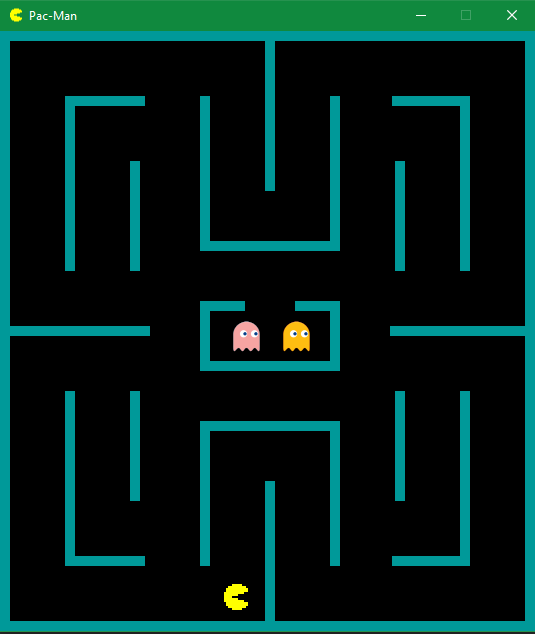
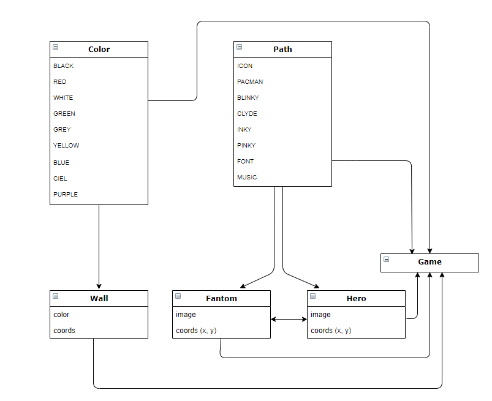

# Projet Pac-Man

## Table des matières
* **1.** [But du jeu](##Butdujeu)
* **2.** [Comment jouer ?](##Commentjouer?)
* **3.** [Les classes (structure interne de notre jeu)](##Lesclasses(structureinternedenotrejeu))
* **4.** [Améliorations nécessaires](##Améliorationsnécessaires)
* **5.** [Cheminement](##Cheminement)
* **6.** [Sources](##Sources)
* **7.** [Collaboration](##Collaboration)

## But du jeu
*Notre jeu est extrêmement connu dans le monde de l'arcade, c'est l'un des jeux les plus connus au monde. Il existe depuis 1980 ([Wikipédia Pac-Man](https://fr.wikipedia.org/wiki/Pac-Man)), ce qui fait de lui un jeu très ancien. Vous connaissez très certainement le principe du jeu mais nous allons très rapidement le ré-expliquer. Le héros du jeu s'appel "Pac-Man" et son but est de manger toutes les petites boules disposées sur l'ensemble de la surface de la map, mais une équipe de 4 fantômes de couleurs différentes feront en sorte d'empêcher Pac-Man de manger l'entièreté des boules, et donc, lui faire perdre la partie.*

## Comment jouer ?
*Suite à un problème de collision entre les personnages et les murs, le jeu n'est actuellement pas jouable, mais pour vous donner une idée générale de ce que le jeu aura comme allure, nous allons expliquer comment celui-ci se jouera. Pour jouer au jeu, vous devrez utiliser les quatres flèches directionnelles de votre clavier pour faire bouger Pac-Man. La flèche du haut le fait monter, celle du bas le fait descendre, celle de gauche le fait tourner à gauche et celle de droite le fait tourner à droite. Dans le cas où vous gagniez la partie ou que vous la perdiez, deux possibilités s'offrent à vous, soit de refaire une partie en appuyant sur "ENTER", soit de quitter le jeu en appuyant sur "ESC". Nous vous proposons également d'écouter la musique en lien avec le jeu, celle-ci est de base présente à l'écoute des joueurs. Pour la désactiver, il vous suffit juste d'appuyer sur "O" et vous verrez donc en-dessous que la musique est en "ON" ou en "OFF".*
  

*Voici un aperçu de notre jeu à l'état actuel, il reste encore beaucoup de choses à faire mais la base est là (Map sur mesure), je vous invite à descendre sous la catégorie "Cheminement" pour voir les étapes du projet.*

## Les classes (structure interne de notre jeu)
* ***Paths :** classe où se trouvent toutes les images nécessaires au bon fonctionnement du jeu (Fantômes / Pac-Man), mais également la police et la musique.*
* ***Colors :** classe où se trouvent toutes les couleurs dont nous aurons besoin, classe très basique.*
* ***Wall :** classe qui va nous permettre de dessiner les rectangles qui vont être les murs du jeu.*
* ***Fantom :*** *classe qui va permettre d'implanter les fantômes à tel ou tel endroit.*
* ***Hero :*** *classe qui va permettre d'implanter Pac-Man à tel ou tel endroit.*
* ***Game :*** *classe la plus importante, c'est par exemple celle qui va dessiner les murs, celle qui permettra de bouger Pac-Man, la classe principale.*

## Améliorations nécessaires
*Le jeu a l'état actuel n'est pas encore "jouable". Il ne manque néanmoins pas beaucoup de choses à faire pour que le jeu soit fini. Il ne reste à rendre les murs "durs".*
## Cheminement
**[1]** *Pour commencer, j'ai tout d'abord commencé par créer les classes les plus simples et les plus générales qui sont les classes "Color" et "Path", ce qui m'a permis d'ajouter les entités que je voulais, ainsique de régler la taille de la fenêtre, qui saura correspondre à la map.*

**[2]** *L'étape suivante consistait à ajouter les murs. C'est une longue étape mais une étape importante car c'est ce qui va donner le challenge au Pac-Man. Il faut prendre le temps de réfléchir au design de la map pour qu'elle soit optimale. Après avoir fait plusieurs croquis sur une feuille, je me suis lancé dans les calculs qui m'ont au final permis de dessiner les murs en faisant en sorte que les entités puissent juste passer entre les murs, ni plus ni moins.* 

**[3]** *La troisième étape consistait à ajouter les lieux d'apparition des différentes entitées (Fantômes & Pac-Man). Les fantômes apparaissent dans leur petite cage 2 par 2 et Pac-Man apparait en bas de la map.*

**[4]** *La suite du programme n'a malheureusement pas pu être faite, en raison des difficultés rencontrées et du manque de temps.*

## Sources 
*Pour les sources utilisées, elles sont classées dans différentes catégories nommées ci-dessous car je n'ai pas utilisé un Tutoriel à part entière mais un ensemble de sources différentes qui m'ont permis d'arriver à mon résultat final.*

* **[Création de rectangles] :**

      https://stackoverflow.com/questions/19780411/pygame-drawing-a-rectangle *(création de rectangles)*
      
* **[Téléchargement des entités] :**

      https://www.geeksforgeeks.org/python-display-images-with-pygame/#:~:text=Create%20a%20Image%20surface%20object,the%20pygame%20window%20using%20display.
  
* **[Document PyGame] :**

      https://www.pygame.org/docs/

* **[Musique] :**

      https://www.youtube.com/watch?v=fk_Klxd3-0A&t=7s

* **[Images] :**

*Les entités utilisées par notre jeu nous ont été données à la suite de notre demande par un volontaire.*

## Collaboration
*Mon ami Léandro (Merci à lui), pour ce jeu, m'a aidé à coder les fonctions qui se situent entre le SetMoving et le SetY (dans la classe Hero), ce sont des fonctions qui ne sont actuellement pas utilisées mais elles le seront plus tard. Le reste du travail a été effectué par moi-même (Bardia).*
